# CGRA 2021/2022

## Grupo T10G05

## Notas do Projeto

### Membros
 - Diogo Moreira 201804904
 - Ana Sofia Teixeira 201806466

### Observações

- Ficou por implementar as alterações de velocidade, como a aceleração e desaceleração, do comboio entre as estações.

- No exercício 5 tivemos dificuldade em perceber como seria para operar com a lenha, o guião não menciona nenhum detalhe de onde se deveria encontrar nem como deveria ser o funcionamento, então para definirmos a estratégia a adotar para o funcionamento da tecla P foi desafiante. No fim, não conseguimos implementar da maneira mais correta daí termos uma adaptação.

- A implementação da tecla P do guindaste ficou de uma maneira diferente. Carregando no P, quando o comboio está parado na estação, ele apanha a madeira dessa estação se ela lá estiver. Ou seja, não é necessário aproximar o guindaste da madeira. E depois de apanhar, o comboio arranca. Ou então através da tecla C, não sendo obrigatório a coleta da madeira. Quando o comboio apanha a madeira de uma estação, vai spawnar a madeira que estiver em falta nas outras estações.

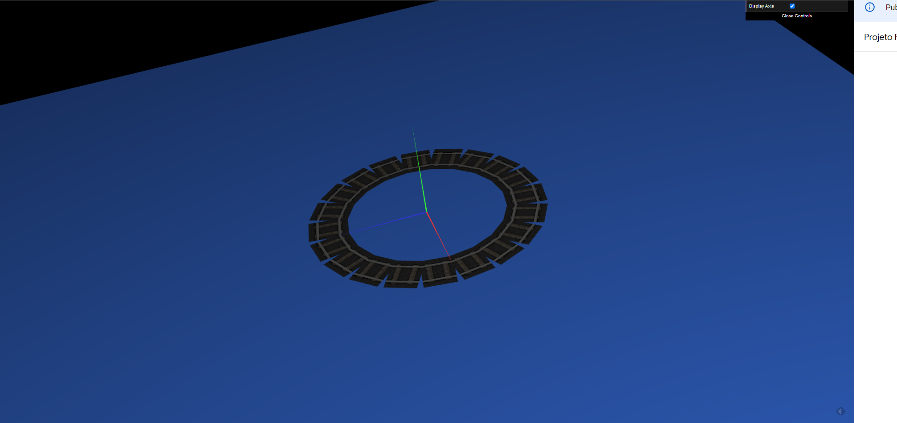
Fig 1. A track usada pelo comboio.

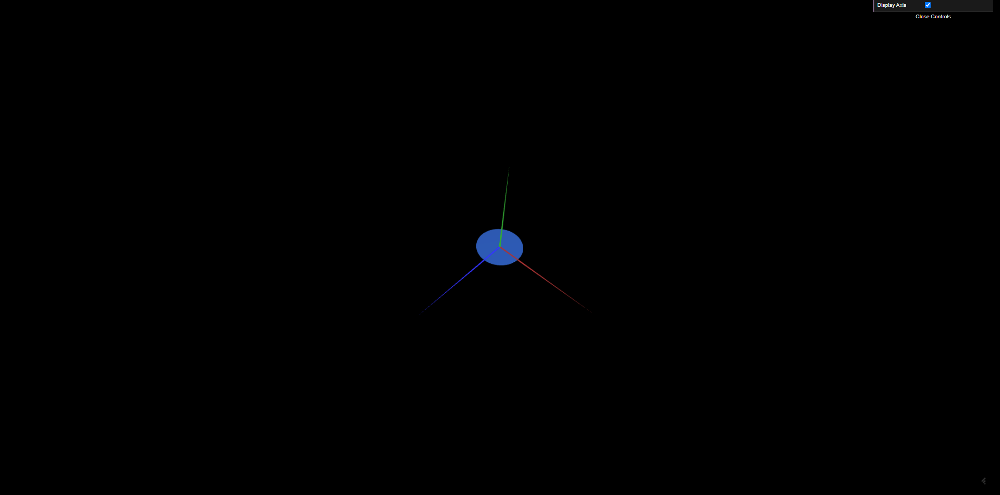
Fig 2. O círculo utilizado para montar várias formas geométricas.

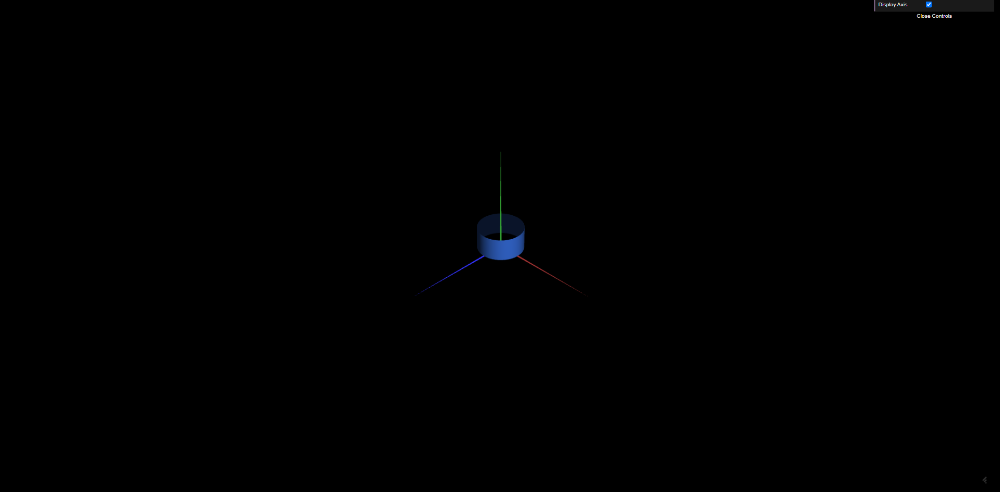
Fig 3. O cilindro utilizado para montar várias formas geométricas.

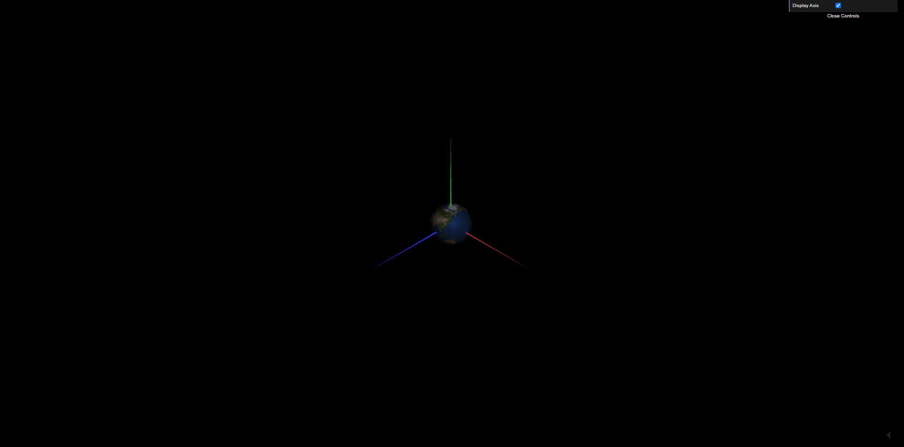
Fig 4. A esfera utilizado para montar várias formas geométricas.

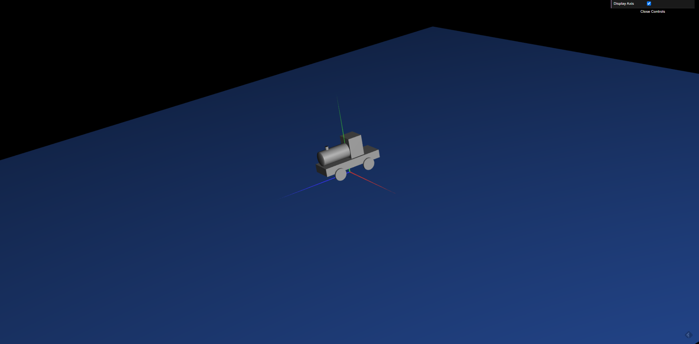
Fig 5. Locomotiva.

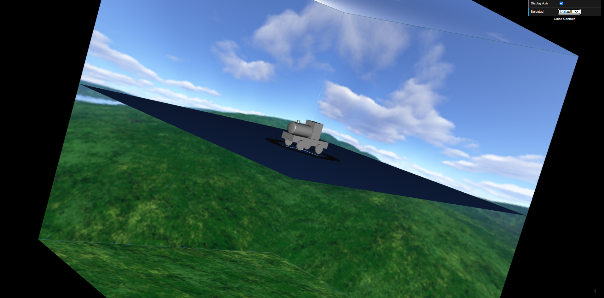
Fig 6. Cubemap e a interface para alterar a textura.

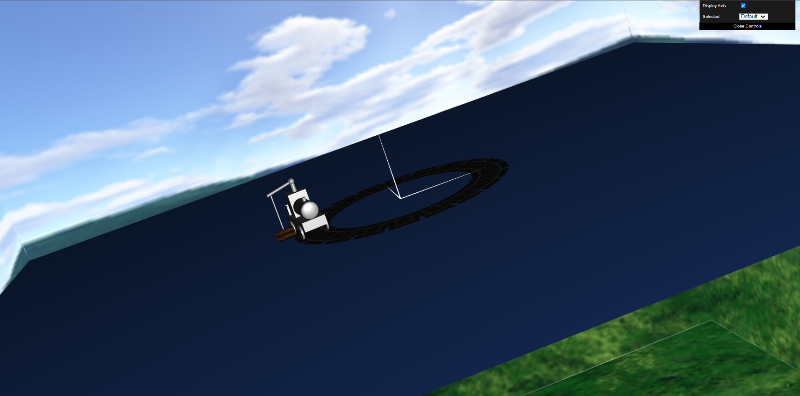
Fig 7. Locomotiva com guindaste e interação com a madeira.

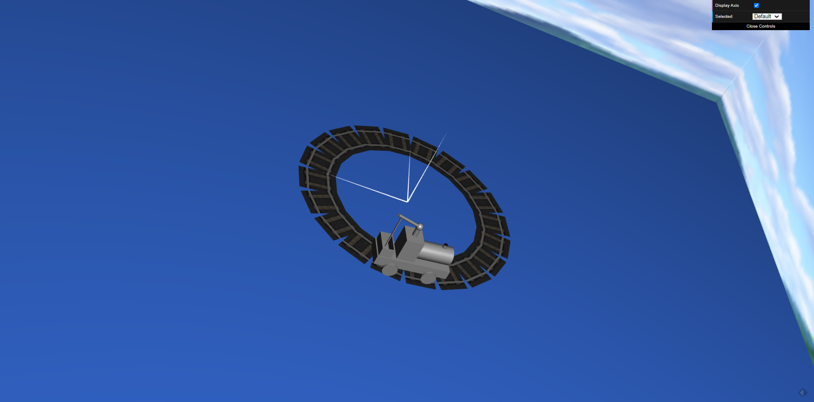
Fig 8. Locomotiva com guindaste e interação com a madeira.

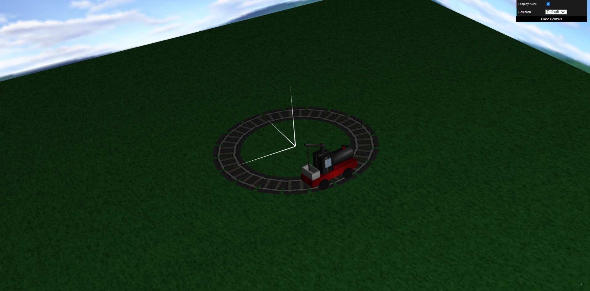
Fig 9. Locomotiva com texturas aplicadas.

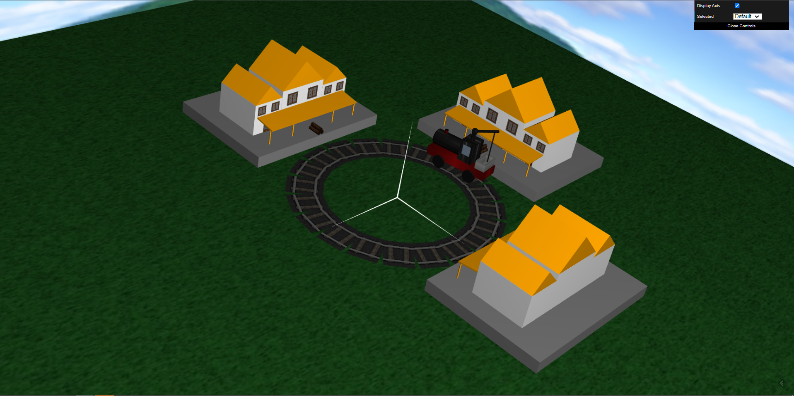
Fig 10. Locomotiva e estação com materiais e texturas aplicadas.

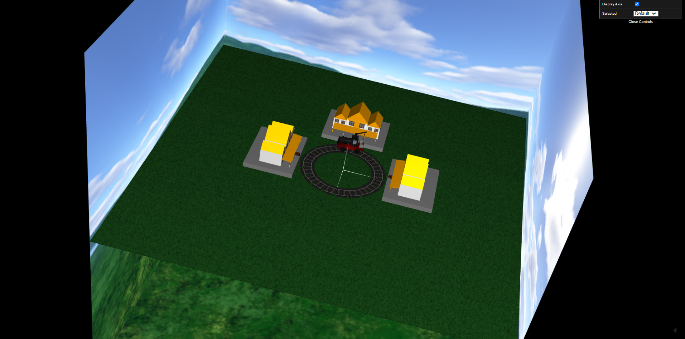
Fig 11. Visão total da cena.