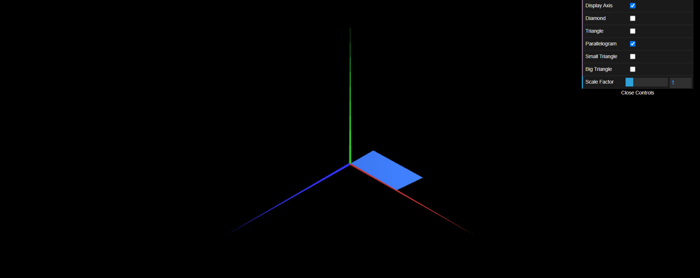

# CGRA 2021/2022

## Group T010G05

## TP 1 Notes

- In exercise 1, as we were at the beginning, we tried to understand what was to be done and how we could do it. After that and after we managed to make the MyTriangle and the respective checkbox, we easily made the MyParallelogram. In the latter, we observe that, for the figure to be double-sided, we have to put the repeated indices but in the opposite direction. We also get a better understanding of the need to divide the figure into triangles.

- In exercise 2, with the practice of exercise 1, we quickly reached the final result.

