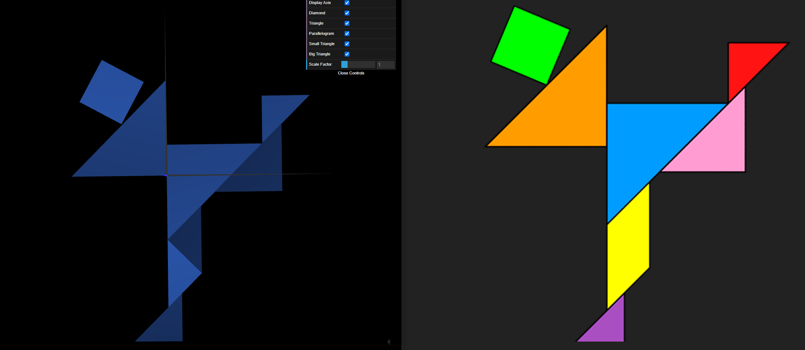
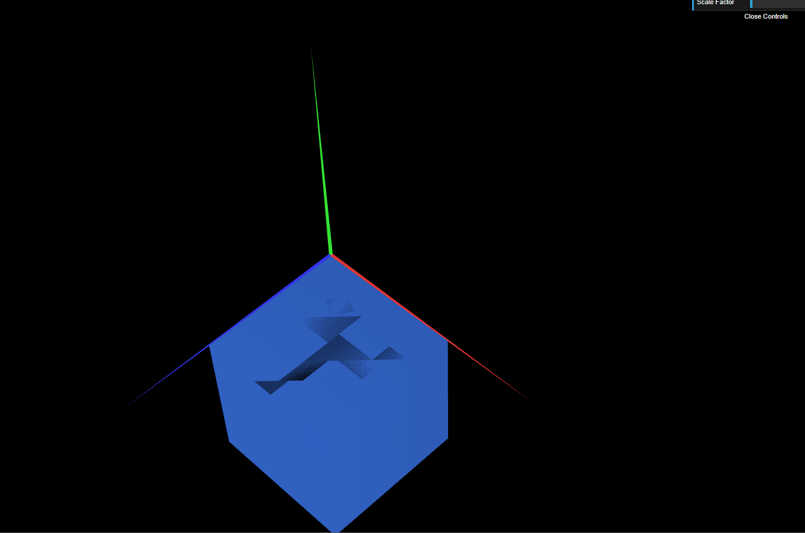
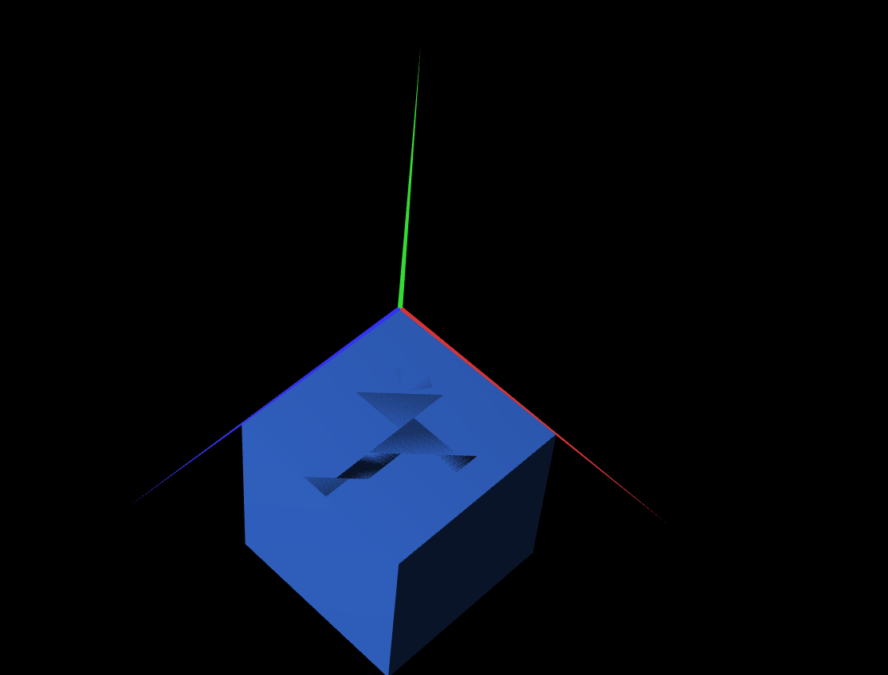

# CGRA 2021/2022

## Group T010G05

## TP 2 Notes

- In exercise 1, as we already had the figures, it was a matter of getting the angles and positions of the figures right so that they fit into each other and get as close as possible to the objective. We did it without much difficulty and after understanding the code syntax, we got to the final result (as we see in the print).

- What we were asked in exercise 2 was to make a unitary cube (defining the 8 vertices of the cube) and then apply some changes to it in order to serve as a basis for the figure in the previous exercise. After changing the position of the tangram and changing dimensions and the position of the cube, we were able to get what we were asked for.

- In exercise 3, after understanding the way to make the cube (using planes drawn several times to define the faces), we just applied and replaced the cube from the previous exercise to get the final result. The differences between the two cubes can be seen in the prints. In the code, it is possible to switch between the cubes by simply commenting and uncommenting the respective lines of code in which the cubes are displayed.

