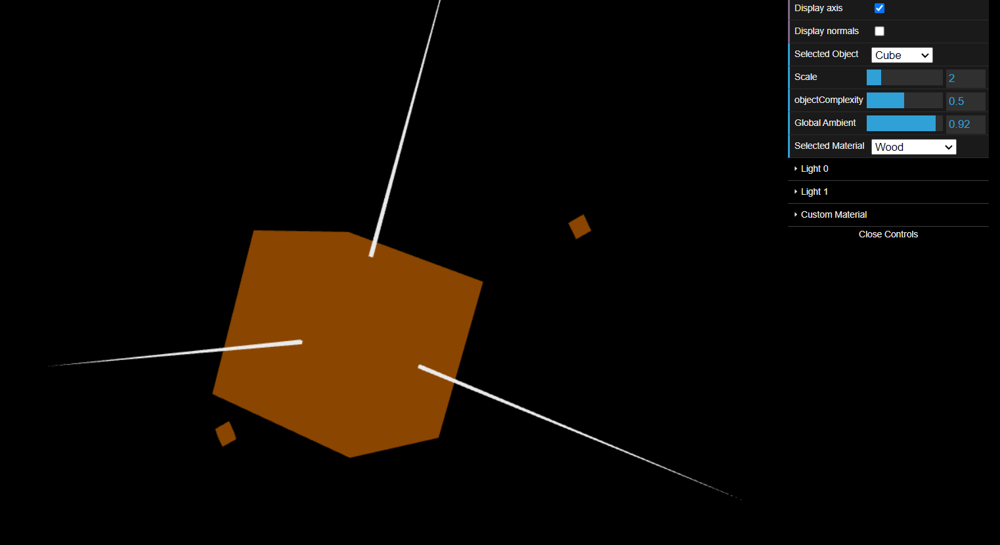
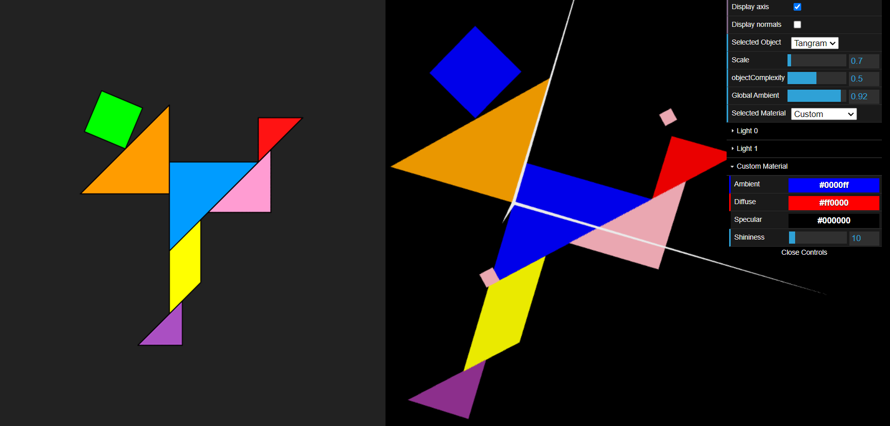

# CGRA 2021/2022

## Group T010G05

## TP 3 Notes

- First, we started to understand the controls, the materials, the lights and everything that was new in this work. After we understand everything and after adding a control in the interface that allows us to vary the intensity of the global ambient lighting of the scene, we move on to the exercises.

- As requested, we added the tangram and unit cube from the previous TP in this scene. After some experiments and comparing with the other figures, we realized that there were some inconsistencies regarding the lights. This was due to the fact that the normals of these 2 figures were not defined. Therefore, the normals were defined. Initially it caused us some confusion but after realizing that it was necessary to create several equal vertices to define different normals, it all made more sense. After the cube and tangram normals were defined, the previous inconsistencies were gone.

- Then we were asked to create a new material with a similar color to wood and try it out on the cube. As we can see from the print, the objective was achieved.

- Regarding the tangram, we were asked to apply the colors according to the figure provided. As we see in the print, the colors are relatively the same except for the diamond. This is because the last point of TP was that the diamond material could be controlled in the interface (custom material). Therefore, in the print we can see the requested and applied colors and we can still see the control of the custom material and the diamond with the same color. We can also change between the true color of the tangram diamond (lime green) and the custom one by commenting and uncommenting the respective lines of code.

