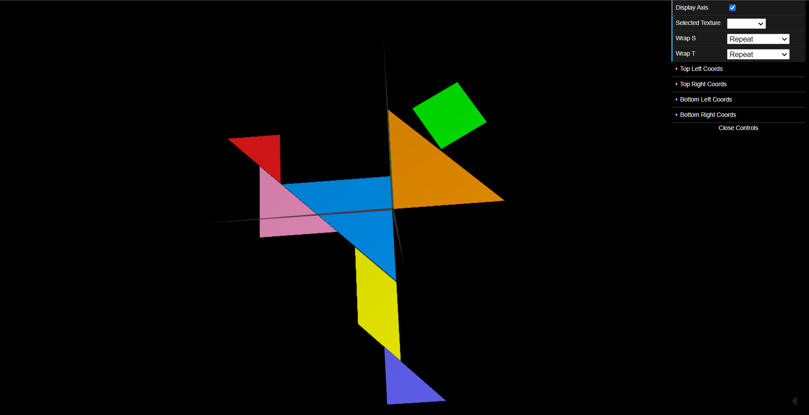
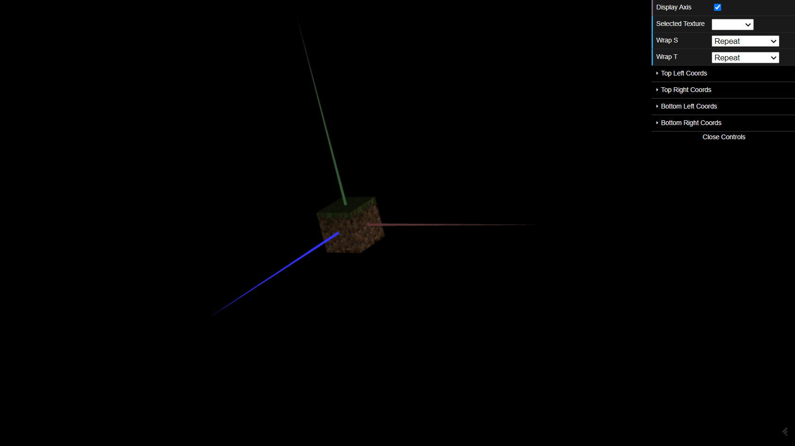

# CGRA 2021/2022

## Group T010G05

## TP 4 Notes

- First, we started to explore the definition of texture coordinates in objects and the different wrapping modes for the application of different textures.

- As requested, created a new initialization material to be applied to the MyTangram class display function, on MyDiamond object. and we setted the image 'tangram.png' as the texture of this material. We determined the texture coordinates to be assigned to each vertex, as it was suggested we opened a copy of 'tangram.png' in an image editor to annotate the S and T axes. We then proceeded to apply this coordinates to all the other figures as it was suggested and we ended up with a perfect result, as we can see in the screenshot.

- During the development of this part we encountered one difficulty. The texture was not appearing at first on the figures but it was just a problem related to where the function initMaterials() is called.

- After we have the cube (drawn several times to define the faces) and after changing the constructor to receive parameters (the textures), we build the cube using the texture in the mineSide.png file for the sides of the cube and the one in mineTop.png and mineBottom.png for the top and bottom of the cube, respectively. We noticed that the texture was a little distorted due to the dimensions of the image and to look good, we had to switch from linear filtering (default) to nearest filtering. 

- After doing this, we have the texture with good definition, as we can see in the screenshot.

